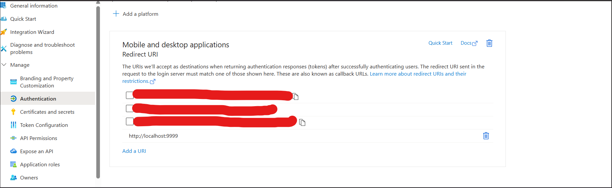

# Microsoft Azure Configuration for MCP Email Integration

## Prerequisites

Before you begin, make sure you have the following:

- A valid Microsoft Azure account.
- Permission to register new applications in Microsoft Entra ID (formerly knows as Azure AD).
- Access to the Microsoft Graph API enabled for your tenant.

---

## Azure App Registration

1. Log in to the [Azure Portal](https://portal.azure.com).
2. Search for **App registrations**.
3. Click on **+ New registration**.
4. Fill out the form:
   - **Name**: Choose any name (e.g., `MCP Email Integration`).
   - **Supported account types**: Choose *Accounts in any organizational directory and personal Microsoft accounts (e.g. Skype, Xbox)* for broader support.
   - **Redirect URI**: Choose *Web* and set it to:  
     `http://localhost:{your_port}`  
     (e.g., `http://localhost:3000`)

   If you forget this step you can also change it later:
   

5. Click **Register**.

---

## API Permissions

After registering the app:


---

## .env Configuration

Create a `.env` file in your project’s `src/` directory with the following content:

```env
# Microsoft Graph API Configuration
CLIENT_ID=your_application_client_id
TENANT_ID=common
SCOPES=User.Read,Mail.Read,Mail.Send
TOKEN_CACHE_FILE=token_cache_microsoft.json
```

**Notes:**
- Replace `your_application_client_id` with the *Application (client) ID* from the Azure portal.
- The `TENANT_ID=common` setting allows both work and personal accounts. You can also use your specific tenant ID if needed.
- The `SCOPES` define the Graph API access the app will request.

---

## Final Notes
- Make sure the port is not blocked or used by another service on your machine.

